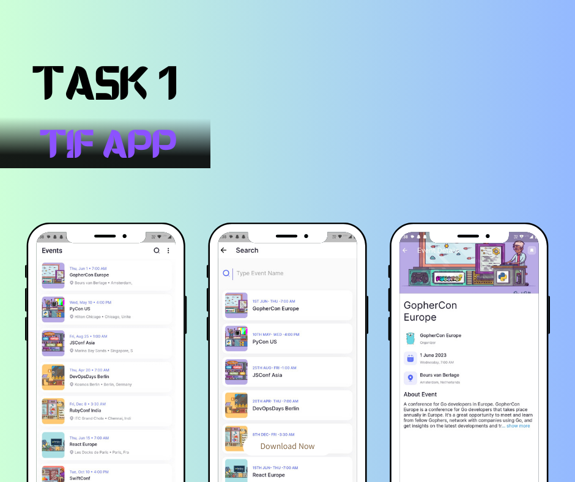

# TIF: Flutter Assignment

This was the task-1 given by TIF team to build an app in Flutter for events, consisting of three screens - Home, Event Details, and Search. The design for these screens can be found in provided Figma file. The Events were to be fetched using provided APIs.


## Screenshots




## 🔗 Links
[](https://drive.google.com/file/d/1GnOCa1EzTBCKXzxycadJvpIWCs1dUpCJ/view?usp=sharing)


## Deployment

Step 1. To deploy this project run

```bash
  flutter pub get
```
Step 2. To run the app

```bash
  flutter run
```


## Features

#### Libraries & Tools Used

- [flutter_bloc](https://pub.dev/packages/flutter_bloc)
- [dio](https://pub.dev/packages/dio)
- [flutter_svg](https://pub.dev/packages/flutter_svg)
- [pretty_dio_logger](https://pub.dev/packages/pretty_dio_logger)
- [cached_network_image](https://pub.dev/packages/cached_network_image)
- [intl](https://pub.dev/packages/intl)
- [expandable_text](https://pub.dev/packages/expandable_text)
- [lottie](https://pub.dev/packages/lottie)

